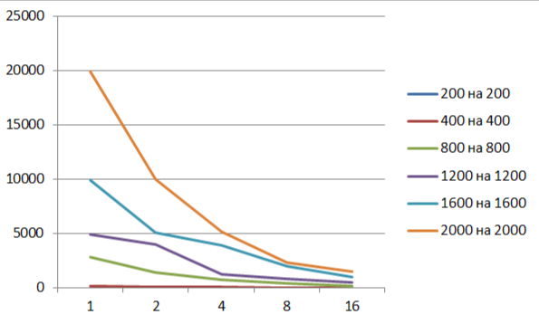

# Отчёт по лабораторной работе № 5

**Выполнил:**
Студент группы **6212-100503D**
ФИО **Слипенчук Никита Сергеевич**

---

## Задание

Паралельную версию программы необходимо запустить на суперкомпьютере "Сергей Королев".Провести серию экспериментов с разным количеством потоков (1, 2, 4, 8 и т.д.), разными размерами матриц (примерно 200, 400, 800, 1200, 1600, 2000), с разным количеством вычислительных ядер (1, 2, 4, 8 и т.д.).

---

## Ход работы

Распараллеленная программа с помощью технологии MPI была запущена на суперкомпьютере. Были проведены эксперименты с матрицами разного 
размера(200,400,800,1200,1600,2000) и разным количеством потоков(1,2,4,8). Результаты в миллисекундах видны в таблице и на графиках:

| Размер матрицы | 1 процесса | 2 процесса | 4 процесса  | 8  процессов | 16 процессов |
|:--------------:|-----------:|-----------:|------------:|-------------:|-------------:|
| 200            | 13         | 8          | 4           | 2            | 1            |
| 400            | 137        | 71         | 35          | 19           | 10           |
| 800            | 2830       | 1420       | 700         | 393          | 140          |
| 1200           | 4902       | 4000       | 1224        | 811          | 450          |
| 1600           | 9934       | 5100       | 3902        | 2000         | 990          |
| 2000           | 19900      | 10000      | 5190        | 2345         | 1500         |

---

## Вывод

С помощью технологии MPI я распаралелил процесс перемножения матриц и запустил программу на суперкомпьютере, а также провел исследование как меняется 
скорость выполенения в зависимости от количества потоков и размера матрицы.

---