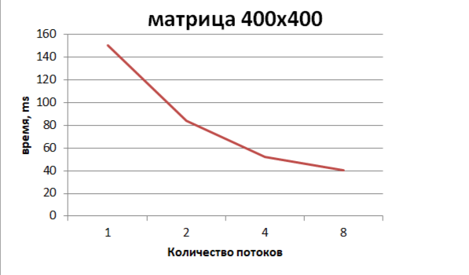
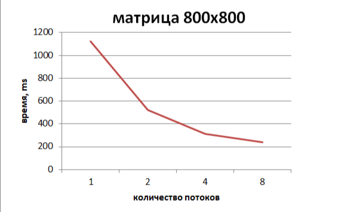
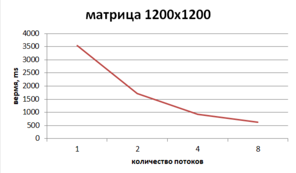
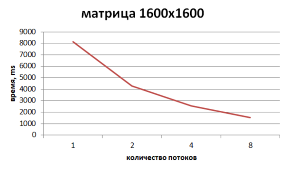
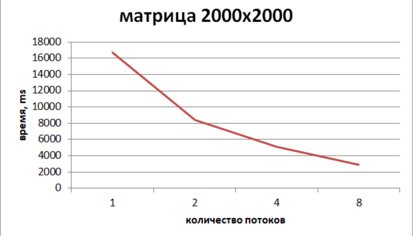

# Отчёт по лабораторной работе № 2

**Выполнил:**
Студент группы **6212-100503D**
ФИО **Слипенчук Никита Сергеевич**

---

## Задание

Модифицировать программу из л/р №1 для параллельной работы по технологии OpenMP. Провести серию экспериментов с разным количеством потоков (1, 2, 4, 8 и т.д.), разными размерами матриц (примерно 200, 400, 800, 1200, 1600, 2000), с разным количеством вычислительных ядер (1, 2, 4, 8 и т.д.).

---

## Ход работы

Метод умножения матриц был распаралелен с помощью библиотеки openmp. Были проведены эксперименты с матрицами разного 
размера(200,400,800,1200,1600,2000) и разным количеством потоков(1,2,4,8). Результаты видны на графиках:

---

## Вывод

С помощью библотеки openmp я распаралелил процесс перемножения матриц и провел исследование как меняется 
скорость выполенения в зависимости от количества потоков и размера матрицы.

---